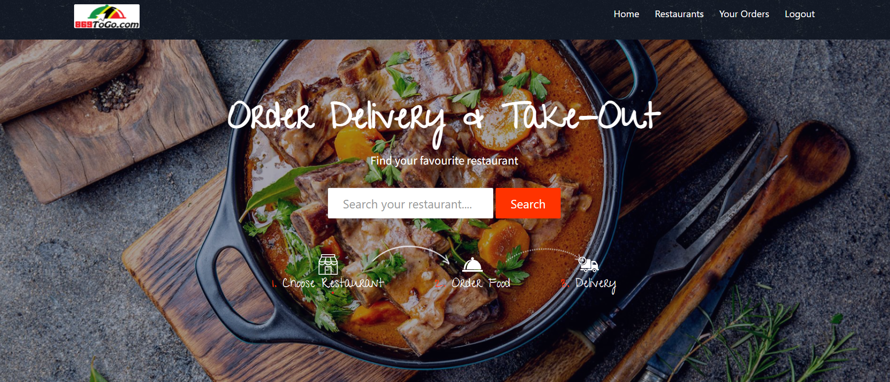

# README

## About this project?

This project is about ordering online food from your local restaurants. Anybody can create an account and order online.  Please note that this project is made for HCI Grad Project

## Installation or Demo

Just create new database in phpmyadmin and import SQL file which is located in `SQL/` directory.

## Technologies Used

1. PHP
2. SQL
3. BOOTSTRAP 4
4. AJAX
5. JQUERY

## System Requirements

Software : XAMPP / Wamp / Mamp/ Lamp \(anyone\).

